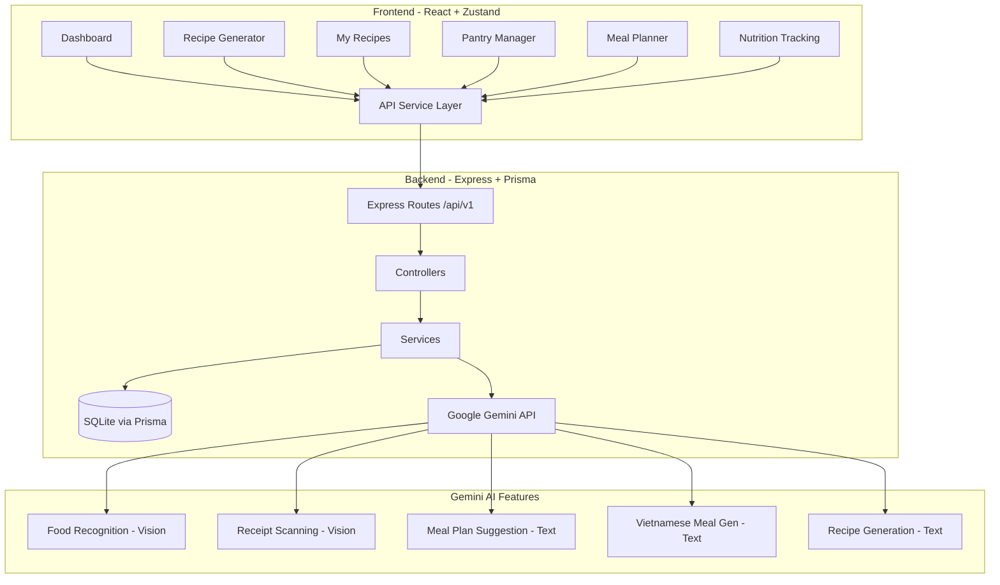
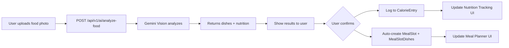
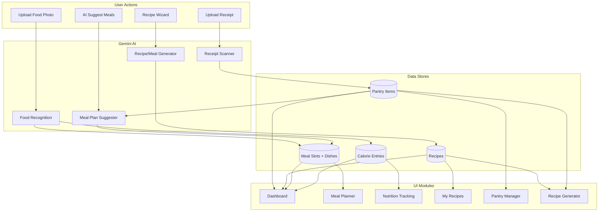

# Mâm Cơm Việt — Implementation Plan

**Core Philosophy:** Deeply integrate the concept of a "Mâm cơm Việt" (Traditional Vietnamese Family Meal) — multiple dishes served together in a single meal, rather than a single-plate dish.

**AI Provider:** Google Gemini (`gemini-2.0-flash`) for both vision and text tasks  
**Architecture:** Wire frontend Zustand store to Express backend APIs  
**Database:** SQLite (Prisma) with schema migration for multi-dish support

---

## Architecture Overview



---

## Phase 1: Database Schema Changes

### Goal
Modify the Prisma schema to support multi-dish meal slots and add user preference fields for AI personalization.

### Schema Changes

#### 1.1 New `MealSlotDish` Junction Table
The current [`MealSlot`](server/prisma/schema.prisma:114) has a 1:1 relationship with Recipe. We need a 1:many relationship to support multiple dishes per meal slot.

```prisma
// NEW: Junction table for multi-dish meal slots
model MealSlotDish {
  id         String   @id @default(uuid)
  mealSlotId String
  recipeId   String?
  customName String?           // For non-recipe dishes
  calories   Int               @default(0)
  protein    Int               @default(0)
  carbs      Int               @default(0)
  fat        Int               @default(0)
  sortOrder  Int               @default(0) // Display order within the meal
  createdAt  DateTime          @default(now)

  mealSlot   MealSlot          @relation(fields: [mealSlotId], references: [id], onDelete: Cascade)
  recipe     Recipe?           @relation(fields: [recipeId], references: [id], onDelete: SetNull)

  @@index([mealSlotId])
  @@map("meal_slot_dishes")
}
```

#### 1.2 Update `MealSlot` Model
- Remove direct `recipeId` and `customName` from MealSlot (move to MealSlotDish)
- Add `dishes` relation
- Remove the unique constraint on `[userId, weekStart, day, mealType]` → replace with a non-unique index (allow multiple meal types or keep unique for the slot itself but have multiple dishes)

**Decision:** Keep `MealSlot` as the slot container (unique per day+mealType), and `MealSlotDish` holds the individual dishes within that slot.

```prisma
model MealSlot {
  id         String   @id @default(uuid)
  userId     String
  weekStart  DateTime
  day        String            // Mon | Tue | Wed | Thu | Fri | Sat | Sun
  mealType   String            // Breakfast | Lunch | Dinner | Snack
  synced     Boolean           @default(false)
  createdAt  DateTime          @default(now)
  updatedAt  DateTime          @updatedAt

  user       User              @relation(fields: [userId], references: [id], onDelete: Cascade)
  dishes     MealSlotDish[]    // NEW: multiple dishes per slot

  @@unique([userId, weekStart, day, mealType])
  @@index([userId, weekStart])
  @@map("meal_slots")
}
```

#### 1.3 Update `User` Model — Add Preferences
```prisma
// Add to User model for AI personalization
dietaryPreferences String   @default("[]")  // JSON: ["vegetarian", "low-carb", etc.]
cuisinePreferences String   @default("[]")  // JSON: ["Vietnamese", "Italian", etc.]
allergies          String   @default("[]")  // JSON: ["nuts", "shellfish", etc.]
familySize         Int      @default(2)
```

#### 1.4 Update `Recipe` Model — Add `MealSlotDish` relation
```prisma
// Add to Recipe model
mealSlotDishes MealSlotDish[]
```

### Files Modified
- [`server/prisma/schema.prisma`](server/prisma/schema.prisma) — Schema changes
- New migration file via `npx prisma migrate dev --name add_multi_dish_support`
- [`server/prisma/seed.js`](server/prisma/seed.js) — Update seed for new schema

---

## Phase 2: Backend AI Service — Google Gemini Integration

### Goal
Create a unified Gemini AI service that handles all AI features using `gemini-2.0-flash`.

### New Dependencies
```bash
cd server && npm install @google/generative-ai
```

### New Files

#### 2.1 `server/src/services/gemini.service.js`
Central Gemini API client with specialized methods:

```javascript
// Methods to implement:

// 1. analyzeFoodImage(imageBuffer) → { dishes: [{ name, calories, protein, carbs, fat }] }
//    Prompt: Analyze this food image. Identify each dish, estimate nutrition per serving.

// 2. analyzeReceiptImage(imageBuffer) → { items: [{ name, category, quantity, unit, estimatedExpiry }] }
//    Prompt: Extract grocery items from this receipt/basket image.

// 3. generateVietnameseMeal(ingredients, preferences) → { mealName, dishes: [{ name, ingredients, steps, nutrition }] }
//    Prompt: Generate a traditional Vietnamese multi-dish meal using these ingredients.

// 4. generateWeeklyMealPlan(pantryItems, preferences, existingPlan) → { days: { Mon: { Breakfast: [...], Lunch: [...], Dinner: [...] } } }
//    Prompt: Suggest a weekly Vietnamese meal plan based on pantry and preferences.

// 5. generateRecipe(wizardData) → { name, ingredients, steps, nutrition, tags }
//    Prompt: Generate a recipe based on these ingredients and constraints.
```

#### 2.2 `server/src/config/gemini.js`
Gemini client initialization with API key from env.

### Environment Variables
Add to [`server/.env`](server/.env.example):
```env
GEMINI_API_KEY=your-gemini-api-key-here
GEMINI_MODEL=gemini-2.0-flash
```

### Files Created
- `server/src/services/gemini.service.js` — Main AI service
- `server/src/config/gemini.js` — Gemini client config

### Files Modified
- [`server/src/config/env.js`](server/src/config/env.js) — Add GEMINI_API_KEY
- [`server/.env.example`](server/.env.example) — Add GEMINI_API_KEY template

---

## Phase 3: Backend API Routes

### Goal
Create new API endpoints for all AI features and update existing endpoints for multi-dish support.

### 3.1 New AI Endpoints

#### Food Recognition API — `POST /api/v1/ai/analyze-food`
- Accepts: multipart image upload
- Returns: Array of detected dishes with nutrition data
- Uses: `gemini.service.analyzeFoodImage()`
- Auto-logs to Meal Planner if `autoLog: true` is passed

#### Receipt Scanner API — `POST /api/v1/ai/scan-receipt`
- Accepts: multipart image upload
- Returns: Array of detected grocery items
- Uses: `gemini.service.analyzeReceiptImage()`

#### Weekly Meal Plan Suggestion — `POST /api/v1/ai/suggest-meal-plan`
- Accepts: `{ weekStart, pantryItemIds?, preferences? }`
- Returns: Suggested meal plan for remaining days of the week
- Uses: `gemini.service.generateWeeklyMealPlan()`

#### Vietnamese Meal Generation — `POST /api/v1/ai/generate-vietnamese-meal`
- Accepts: `{ ingredients: [], mealType, servings, preferences }`
- Returns: Complete multi-dish Vietnamese meal
- Uses: `gemini.service.generateVietnameseMeal()`

### 3.2 Updated Endpoints

#### Recipe Generation — `POST /api/v1/recipes/generate`
- Update to support multi-dish output format
- Add `style: "vietnamese_meal" | "single_dish"` parameter
- Returns array of complementary dishes when `style === "vietnamese_meal"`

#### Meal Plan Slot — `PUT /api/v1/meal-plan/slot`
- Update to support multiple dishes per slot
- New body: `{ weekStart, day, mealType, dishes: [{ recipeId?, customName?, calories?, ... }] }`

#### Meal Plan Week — `GET /api/v1/meal-plan/week`
- Update response to include `dishes[]` array per slot

### New Files
- `server/src/routes/ai.routes.js`
- `server/src/controllers/ai.controller.js`
- `server/src/validators/ai.validator.js`

### Files Modified
- [`server/src/routes/index.js`](server/src/routes/index.js) — Mount ai routes
- `server/src/controllers/mealPlan.controller.js` — Multi-dish support
- `server/src/services/mealPlan.service.js` — Multi-dish queries

---

## Phase 4: Frontend API Service Layer

### Goal
Create a frontend API client and wire Zustand store actions to backend APIs instead of in-memory mock data.

### New Files

#### 4.1 `src/services/api.js` — Axios instance
```javascript
// Base URL: /api/v1 (proxied via CRA)
// Auth interceptor: attach JWT from localStorage
// Error interceptor: handle 401 → redirect to login
```

#### 4.2 `src/services/aiService.js` — AI feature API calls
```javascript
export const analyzeFood = (imageFile) => api.postForm('/ai/analyze-food', { image: imageFile });
export const scanReceipt = (imageFile) => api.postForm('/ai/scan-receipt', { image: imageFile });
export const suggestMealPlan = (data) => api.post('/ai/suggest-meal-plan', data);
export const generateVietnameseMeal = (data) => api.post('/ai/generate-vietnamese-meal', data);
```

#### 4.3 `src/services/recipeService.js`
#### 4.4 `src/services/pantryService.js`
#### 4.5 `src/services/mealPlanService.js`
#### 4.6 `src/services/calorieService.js`

### Files Modified
- [`src/store/useAppStore.js`](src/store/useAppStore.js) — Update actions to call backend APIs
- Add `axios` dependency to root [`package.json`](package.json)

---

## Phase 5: My Recipes Module UI Updates

### Goal
Enhance the recipe detail view and add Ingredients/Instructions fields to the manual add form.

### 5.1 Enhanced Detail View
**Current:** Small side panel (1/3 width) showing only nutrition + tags + notes.  
**New:** Larger detail panel showing Ingredients list + Instructions steps prominently.

Changes to [`src/views/admin/my-recipes/index.jsx`](src/views/admin/my-recipes/index.jsx):
- Change grid from `xl:grid-cols-3` to `xl:grid-cols-5` (2 cols list + 3 cols detail)
- Add scrollable Ingredients section with bullet list
- Add numbered Instructions/Steps section
- Larger nutrition cards
- "Cook this" action button

### 5.2 Add/Edit Form — Ingredients & Instructions Fields
**Current [`EMPTY_FORM`](src/views/admin/my-recipes/index.jsx:31):** Only has name, times, servings, macros, tags, notes.  
**New:** Add dynamic ingredient list builder + step-by-step instructions editor.

```javascript
const EMPTY_FORM = {
  // ... existing fields
  ingredients: [{ amount: "", unit: "", name: "" }],  // NEW: dynamic list
  steps: [""],                                          // NEW: dynamic list
};
```

UI additions inside the modal:
- **Ingredients:** Repeatable row with Amount / Unit / Name inputs + Add/Remove buttons
- **Instructions:** Repeatable textarea rows with step numbers + Add/Remove buttons

### Files Modified
- [`src/views/admin/my-recipes/index.jsx`](src/views/admin/my-recipes/index.jsx) — Major UI overhaul

---

## Phase 6: Dashboard Quick Actions Update

### Goal
Update Quick Actions to include shortcuts to ALL features in the application.

### Current Quick Actions (4 items):
1. Track Calories
2. AI Recipe Generator
3. My Pantry
4. Profile Settings

### New Quick Actions (7 items):
1. 🔥 Track Calories → `/admin/nutrition-tracking`
2. ✨ AI Recipe Generator → `/admin/recipe-generator`
3. 📦 My Pantry → `/admin/pantry`
4. 📅 Meal Planner → `/admin/meal-planner`
5. 📖 My Recipes → `/admin/my-recipes`
6. 📸 Scan Food → `/admin/nutrition-tracking` (with auto-open camera)
7. ⚙️ Profile Settings → `/admin/profile`

### Files Modified
- [`src/views/admin/default/index.jsx`](src/views/admin/default/index.jsx) — Update `quickActions` array

---

## Phase 7: Meal Planner Overhaul

### Goal
Major redesign of the Meal Planner with soft lock, multi-dish support, AI suggestions, and today-focused UI.

### 7.1 Soft Lock for Past Days
- Past days get a semi-transparent overlay with reduced opacity (0.5)
- Clicking a past day shows a confirmation dialog: "This day has passed. Edit anyway?"
- Only applies when viewing the current week (`selectedWeekOffset === 0`)

### 7.2 UI Focus on Today & Future
- Today's column gets a highlighted border and "TODAY" badge
- Today's column is wider (1.5x) or visually emphasized with brand color border
- Future days have full opacity and interactive state
- Past days are dimmed

### 7.3 Multi-dish Support per Meal Slot

**Current [`MealSlotCard`](src/views/admin/meal-planner/components/MealSlotCard.jsx):** Shows single dish name + calories.  
**New:** Shows multiple dishes stacked, with total calories aggregated.

```
┌─────────────────────┐
│ 🟡 LUNCH            │
│ ├─ Canh rau muống   │
│ ├─ Thịt luộc        │
│ ├─ Đậu phụ sốt cà  │
│ └─ Cơm trắng        │
│ 🔥 Total: 680 kcal  │
│ [+ Add dish]         │
└─────────────────────┘
```

New component: `MultiDishMealSlotCard.jsx`
- Renders list of dishes with individual remove buttons
- Shows aggregated calories
- "Add dish" button at bottom
- Expandable/collapsible for slots with 3+ dishes

### 7.4 AI Suggestion for Upcoming Days
- "✨ AI Suggest" button in the header
- Calls `POST /api/v1/ai/suggest-meal-plan` with current pantry + preferences
- Auto-fills empty slots for remaining days of the current week
- Shows preview modal before applying suggestions
- Suggestions follow Vietnamese meal structure (multi-dish)

### 7.5 Zustand Store Updates
Update [`weeklyPlan`](src/store/useAppStore.js:278) structure:

```javascript
// OLD: weeklyPlan["Mon-Lunch"] = { recipeId, name, calories, ... }
// NEW: weeklyPlan["Mon-Lunch"] = { dishes: [{ recipeId, name, calories, ... }, ...] }
```

### Files Modified
- [`src/views/admin/meal-planner/index.jsx`](src/views/admin/meal-planner/index.jsx) — Major overhaul
- [`src/views/admin/meal-planner/components/MealSlotCard.jsx`](src/views/admin/meal-planner/components/MealSlotCard.jsx) — Replace with multi-dish version
- [`src/store/useAppStore.js`](src/store/useAppStore.js) — Update weeklyPlan structure

### New Files
- `src/views/admin/meal-planner/components/MultiDishMealSlotCard.jsx`
- `src/views/admin/meal-planner/components/AISuggestionModal.jsx`
- `src/views/admin/meal-planner/components/PastDayConfirmDialog.jsx`

---

## Phase 8: AI Recipe Generator Enhancements

### Goal
Upgrade the Recipe Generator for Vietnamese multi-dish meal output + "Use All Pantry" button.

### 8.1 Multi-dish Vietnamese Meal Generation

**Current flow:** Wizard → Generate → Single recipe result  
**New flow:** Wizard → Generate → Complete Vietnamese meal (3-5 complementary dishes)

Changes to [`RecipeGenerator`](src/views/admin/recipe-generator/index.jsx:483):
- Add a new Step or toggle: "Meal Style" — Single Dish vs. Vietnamese Multi-dish Meal
- When "Vietnamese Multi-dish" is selected:
  - Generate button calls `POST /api/v1/ai/generate-vietnamese-meal`
  - Result shows a meal card with all dishes listed
  - Each dish can be individually saved to My Recipes
  - "Save Entire Meal" saves all dishes at once

**New result card:** `VietnameseMealResultCard.jsx`
```
┌──────────────────────────────────────────┐
│ 🍲 Mâm Cơm Việt — Bữa Tối             │
│ "Vietnamese Family Dinner"               │
│                                          │
│ ┌──────────┐ ┌──────────┐ ┌──────────┐  │
│ │Canh rau  │ │Thịt kho  │ │Đậu phụ  │  │
│ │muống     │ │tàu       │ │chiên    │  │
│ │85 kcal   │ │320 kcal  │ │180 kcal │  │
│ │[Save]    │ │[Save]    │ │[Save]   │  │
│ └──────────┘ └──────────┘ └──────────┘  │
│                                          │
│ 🍚 Cơm trắng (White Rice) — 200 kcal    │
│                                          │
│ Total: 785 kcal | P: 52g | C: 88g | F: 28g │
│                                          │
│ [Save All to My Recipes] [Add to Meal Plan] │
└──────────────────────────────────────────┘
```

### 8.2 "Use All Pantry" Button

Add button in Step 1 (Ingredients):
```
[📦 Add All Pantry Items]
```

- Fetches all items from `GET /api/v1/pantry`
- Adds all pantry item names to the selected ingredients list
- Shows toast: "Added 12 items from your pantry"

Changes to [`StepIngredients`](src/views/admin/recipe-generator/index.jsx:98):
- Add button above the pantry items section
- One-click to select all pantry items as ingredients

### Files Modified
- [`src/views/admin/recipe-generator/index.jsx`](src/views/admin/recipe-generator/index.jsx) — Add meal style toggle, Use All Pantry button
- [`src/views/admin/recipe-generator/components/RecipeResultCard.jsx`](src/views/admin/recipe-generator/components/RecipeResultCard.jsx) — Update for multi-dish
- [`src/views/admin/recipe-generator/variables/mockData.js`](src/views/admin/recipe-generator/variables/mockData.js) — Add Vietnamese meal mock

### New Files
- `src/views/admin/recipe-generator/components/VietnameseMealResultCard.jsx`

---

## Phase 9: Food Recognition → Auto-log to Meal Planner

### Goal
When AI recognizes food from a photo, automatically log it into the corresponding meal slot in the weekly meal plan.

### Flow


### Implementation
- In [`NutritionTracking`](src/views/admin/nutrition-tracking/index.jsx), update `handlePhotoUpload`:
  1. Call `POST /api/v1/ai/analyze-food` with image
  2. Gemini returns array of detected dishes (supports multi-dish Vietnamese meals!)
  3. Show detection results modal with individual dish nutrition
  4. On confirm: 
     - Create CalorieEntry for each dish
     - Auto-create/update MealSlot for current day + detected mealType
     - Add MealSlotDish records for each detected dish

### Files Modified
- [`src/views/admin/nutrition-tracking/index.jsx`](src/views/admin/nutrition-tracking/index.jsx) — Update photo analysis flow
- Backend: `server/src/services/calories.service.js` — Auto-sync to meal planner

---

## Phase 10: Receipt/Grocery → Pantry AI Feature

### Goal
Replace the mock receipt scanning with real Gemini Vision analysis.

### Current State
[`PantryImageUploadZone`](src/views/admin/pantry/index.jsx:56) uses a hardcoded `setTimeout` returning fixed items.

### New Implementation
- Replace mock with real API call to `POST /api/v1/ai/scan-receipt`
- Gemini Vision analyzes the receipt/grocery image
- Returns structured data: item name, category, estimated quantity, unit, estimated expiry
- User reviews detected items in modal, can edit before adding
- Bulk add to pantry via `POST /api/v1/pantry/bulk`

### Files Modified
- [`src/views/admin/pantry/index.jsx`](src/views/admin/pantry/index.jsx) — Wire to real API
- `server/src/controllers/ai.controller.js` — Receipt scanning endpoint

---

## Phase 11: Smart Weekly Meal Plan AI Suggestion

### Goal
AI recommender that suggests a weekly menu based on pantry, preferences, and eating habits.

### Implementation

#### Backend
- `POST /api/v1/ai/suggest-meal-plan`
- Input: Current pantry items, user dietary preferences, cuisine preferences, family size, existing meals already planned
- Gemini generates a Vietnamese-style weekly plan with multi-dish meals
- Each meal follows the "Mâm cơm Việt" structure:
  - 1 soup (canh)
  - 1-2 main protein dishes
  - 1 vegetable side dish
  - Rice (implied)

#### Gemini Prompt Template
```
You are a Vietnamese nutrition expert. Generate a weekly meal plan for a family of {familySize}.

Available pantry ingredients: {pantryItems}
Dietary preferences: {preferences}
Allergies to avoid: {allergies}
Already planned meals: {existingPlan}

For each remaining day (Mon-Sun), suggest Breakfast, Lunch, and Dinner.
Each Lunch and Dinner should be a traditional Vietnamese "mâm cơm" with 3-4 complementary dishes.
Ensure nutritional balance across the week.
Output as structured JSON.
```

#### Frontend
- Button in Meal Planner header: "✨ AI Suggest Remaining Days"
- Preview modal showing all suggestions
- User can accept/reject individual days or meals
- Accept applies suggestions to the weekly plan

### Files Modified
- [`src/views/admin/meal-planner/index.jsx`](src/views/admin/meal-planner/index.jsx) — AI suggest button + modal
- `server/src/services/gemini.service.js` — Meal plan generation method

---

## Phase 12: Integration Testing & Polish

### Tasks
- End-to-end testing of all AI features
- Error handling for Gemini API failures (rate limits, network errors)
- Loading states and skeleton UIs for AI operations
- Toast notifications for successful actions
- Responsive design verification for all new components
- Update seed data to include Vietnamese recipes
- Dark mode compatibility for all new UI elements

---

## Data Flow Diagram — Complete System



---

## File Change Summary

### New Files (Backend)
| File | Purpose |
|------|---------|
| `server/src/config/gemini.js` | Gemini client initialization |
| `server/src/services/gemini.service.js` | All Gemini AI methods |
| `server/src/routes/ai.routes.js` | AI-specific API routes |
| `server/src/controllers/ai.controller.js` | AI endpoint handlers |
| `server/src/validators/ai.validator.js` | AI request validation |
| `server/src/routes/recipes.routes.js` | Recipe CRUD + generate |
| `server/src/controllers/recipes.controller.js` | Recipe handlers |
| `server/src/services/recipe.service.js` | Recipe business logic |
| `server/src/routes/pantry.routes.js` | Pantry CRUD + scan |
| `server/src/controllers/pantry.controller.js` | Pantry handlers |
| `server/src/services/pantry.service.js` | Pantry business logic |
| `server/src/routes/mealPlan.routes.js` | Meal plan CRUD |
| `server/src/controllers/mealPlan.controller.js` | Meal plan handlers |
| `server/src/services/mealPlan.service.js` | Meal plan business logic |
| `server/src/routes/calories.routes.js` | Calorie CRUD + analyze |
| `server/src/controllers/calories.controller.js` | Calorie handlers |
| `server/src/services/calories.service.js` | Calorie business logic |
| `server/src/routes/dashboard.routes.js` | Dashboard stats |
| `server/src/controllers/dashboard.controller.js` | Dashboard handlers |
| `server/src/services/dashboard.service.js` | Dashboard aggregation |
| `server/src/middleware/auth.js` | JWT auth middleware |
| `server/src/middleware/upload.js` | Multer config |

### New Files (Frontend)
| File | Purpose |
|------|---------|
| `src/services/api.js` | Axios instance + interceptors |
| `src/services/aiService.js` | AI API calls |
| `src/services/recipeService.js` | Recipe API calls |
| `src/services/pantryService.js` | Pantry API calls |
| `src/services/mealPlanService.js` | Meal plan API calls |
| `src/services/calorieService.js` | Calorie API calls |
| `src/services/dashboardService.js` | Dashboard API calls |
| `src/views/admin/meal-planner/components/MultiDishMealSlotCard.jsx` | Multi-dish slot UI |
| `src/views/admin/meal-planner/components/AISuggestionModal.jsx` | AI suggestion preview |
| `src/views/admin/meal-planner/components/PastDayConfirmDialog.jsx` | Soft lock confirmation |
| `src/views/admin/recipe-generator/components/VietnameseMealResultCard.jsx` | Multi-dish result |

### Modified Files
| File | Changes |
|------|---------|
| [`server/prisma/schema.prisma`](server/prisma/schema.prisma) | Add MealSlotDish, update MealSlot, User preferences |
| [`server/prisma/seed.js`](server/prisma/seed.js) | Update for new schema + Vietnamese sample data |
| [`server/src/index.js`](server/src/index.js) | No changes needed |
| [`server/src/config/env.js`](server/src/config/env.js) | Add GEMINI_API_KEY |
| [`server/src/routes/index.js`](server/src/routes/index.js) | Mount all route modules |
| [`server/package.json`](server/package.json) | Add @google/generative-ai |
| [`package.json`](package.json) | Add axios |
| [`src/store/useAppStore.js`](src/store/useAppStore.js) | Wire to backend APIs, update weeklyPlan structure |
| [`src/views/admin/default/index.jsx`](src/views/admin/default/index.jsx) | Update Quick Actions |
| [`src/views/admin/my-recipes/index.jsx`](src/views/admin/my-recipes/index.jsx) | Enhanced detail view, ingredients/instructions form |
| [`src/views/admin/meal-planner/index.jsx`](src/views/admin/meal-planner/index.jsx) | Major overhaul: soft lock, multi-dish, AI suggest, today focus |
| [`src/views/admin/meal-planner/components/MealSlotCard.jsx`](src/views/admin/meal-planner/components/MealSlotCard.jsx) | Multi-dish display |
| [`src/views/admin/recipe-generator/index.jsx`](src/views/admin/recipe-generator/index.jsx) | Vietnamese meal toggle, Use All Pantry |
| [`src/views/admin/recipe-generator/components/RecipeResultCard.jsx`](src/views/admin/recipe-generator/components/RecipeResultCard.jsx) | Support multi-dish output |
| [`src/views/admin/pantry/index.jsx`](src/views/admin/pantry/index.jsx) | Wire to real Gemini receipt scanning |
| [`src/views/admin/nutrition-tracking/index.jsx`](src/views/admin/nutrition-tracking/index.jsx) | Real food recognition + auto-log to meal planner |

---

## Implementation Order

| Phase | Description | Dependencies |
|-------|-------------|--------------|
| **1** | Database schema changes + migration | None |
| **2** | Gemini AI service (backend) | Phase 1 |
| **3** | Backend API routes (all modules) | Phase 1, 2 |
| **4** | Frontend API service layer + Zustand wiring | Phase 3 |
| **5** | My Recipes UI updates | Phase 4 |
| **6** | Dashboard Quick Actions | None (independent) |
| **7** | Meal Planner overhaul | Phase 1, 3, 4 |
| **8** | Recipe Generator enhancements | Phase 2, 3, 4 |
| **9** | Food Recognition → Auto-log | Phase 2, 3, 7 |
| **10** | Receipt/Grocery → Pantry | Phase 2, 3, 4 |
| **11** | Smart Weekly Meal Plan AI | Phase 2, 3, 7 |
| **12** | Integration testing & polish | All phases |
